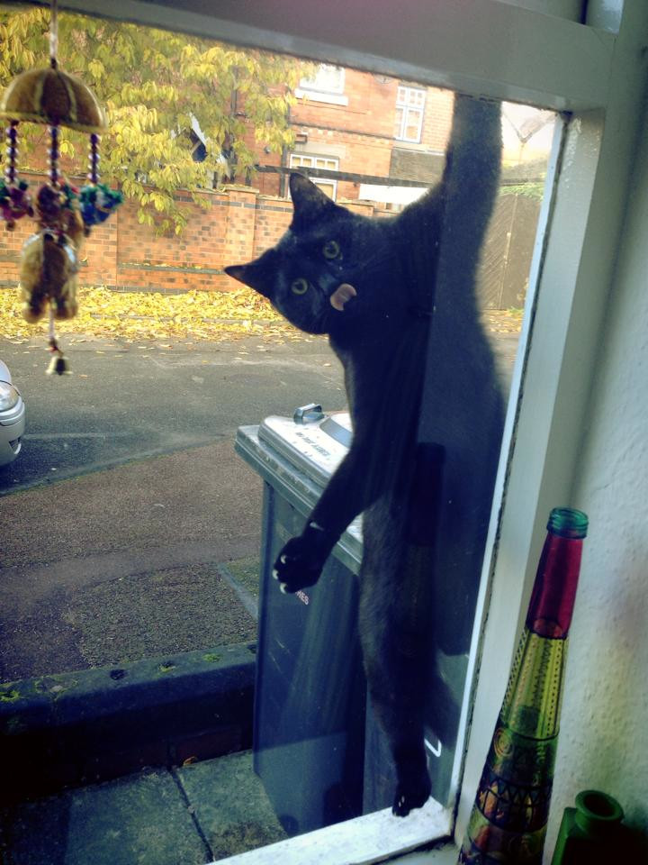

% "If we don't try, we will not know how our luck falls." -- Saga of King Hrolf Kraki / Byock
% @killerswan
% Kevin Cantu <me@kevincantu.org>


# Rust Testing 101
* --test
* "#[test]"
* "#[bench]"
* Travis.CI



# Flags to `rustc`
```sh
rustc --bin  main.rs -o main
rustc --test main.rs -o main_tests
```

# Flags to `rustc`
```sh
rustc --bin  main.rs -o main
rustc --test main.rs -o main_tests --allow dead_code
```

# Symbols when compiled (--bin)
* tests are skipped
```
EXCERPT
```

# my makefile / substitute rustpkg

# tying it all together
```sh
$ rustpkg testloop -h
Usage: rustpkg testloop [--bench] [--opt-level [0-3]]
```


