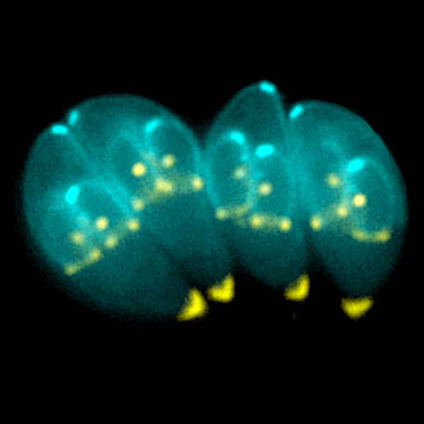
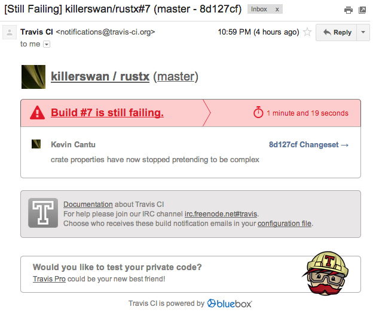
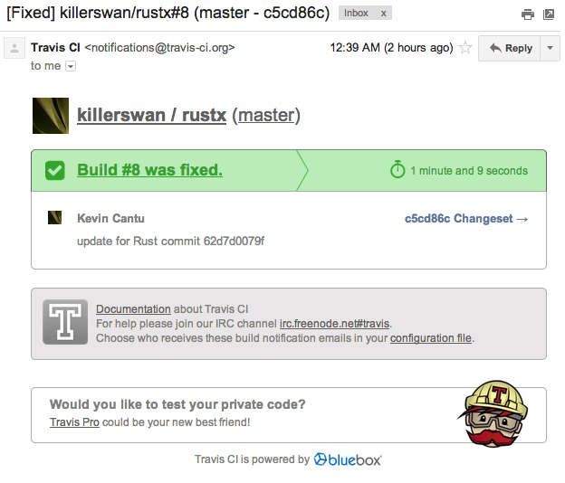

% Testing in Rust
% Kevin Cantu (@killerswan) <<me@kevincantu.org>>
% February 25, 2014


-------

## "Do not test the Lord your God."
-- The Bible, Luke 4:12


1. The *scientific method*.

2. Rust, now.

3. Rust, in the future.


# What is the scientific method?


# What is the scientific method?

1. We cannot see everything.
2. Good claims make **testable predictions**.


# What is the scientific method?

Go read some *Thomas Kuhn*.

But don't take anybody's word for it:
ask questions.


# Avoid senseless claims


# But what if I can *prove* it mathematically?



Image provided by Ke Hu and John Murray. [DOI: 10.1371/journal.ppat.0020020.g001]


# Software engineering


# Software engineering: cheap negative proofs

1. type checking errors

2. test failures


# Bug reports and exploits: expensive negative proofs


# Tools Rust gives us now


# Hello world
```rust
extern crate extra;
use std::io;

#[main]
fn say_hi () {
   io::println("Hello, @KarlTheFog!");
}
```

# Hello world (test)
```rust
#[test]
fn addition_works () {
   assert! (2 + 2 == 4);
}
```


# Building

```sh
$ rustc        main.rs -o main
$ rustc --test main.rs -o test
```


# Running

```sh
$ ./main
Hello, @KarlTheFog!
$ ./test

running 2 tests
test addition_works ... ok
test addition_benchmarked ... ignored

test result: ok. 1 passed; 0 failed; 1 ignored; 0 measured
```


# What was that?

```rust
#[bench]
fn addition_benchmarked (b: &mut extra::test::BenchHarness) {
   let mut sum = 0;
   b.iter(|| sum += 1)
}
```


# Running benchmarks, too

```sh
$ ./test --bench --test

running 2 tests
test addition_works ... ok
test addition_benchmarked ... bench:        32 ns/iter (+/- 12)

test result: ok. 1 passed; 0 failed; 0 ignored; 1 measured
```


# Benchmark metrics (saving)

```sh
$ ./test --bench --save-metrics sample.json
```

```json
{
  "addition_benchmarked": {
    "noise": 16.1,
    "value": 34
  }
}
```


# Benchmark metrics (ratcheting)

```sh
$ ./test --bench --ratchet-metrics sample.json
```

Note: will actually update the `sample.json`...


# Sharding

Run half of tests on each machine:
```sh
$ ./demo --test-shard 0.2

running 4 tests
test testA ... ok
test testE ... ok
test testC ... ok
test testG ... ok

test result: ok. 4 passed; 0 failed; 0 ignored; 0 measured
```

```sh
$ ./demo --test-shard 1.2

running 3 tests
test testB ... ok
test testD ... ok
test testF ... ok

test result: ok. 3 passed; 0 failed; 0 ignored; 0 measured
```


# Continuous integration


# Rust.CI

Instructions here: <http://www.rust-ci.org/help/>

.travis.yml:
```yml
before_install:
  - yes | sudo add-apt-repository ppa:hansjorg/rust
  - sudo apt-get update

install:
  - sudo apt-get install rust-nightly

script:
  - rustc        src/demo.rs -o demo
  - ./demo
  - rustc --test src/demo.rs -o test
  - ./test --test --bench
```


# Rust.CI



# Rust.CI



# Experiment: testloop
```sh
$ ./bin/testloop ./src/demo.rs --test --bench

<<<< building tests >>>>
Running `/usr/local/bin/rustc` with args: &[~"-o", ~"/Users/kevin/code/meow/.tests_in_loop.exe", ~"--test", ~"/Users/kevin/code/meow/src/demo.rs", ~"--allow", ~"dead_code", ~"--opt-level", ~"0"]

<<<< running tests >>>>
Running `/Users/kevin/code/meow/.tests_in_loop.exe` with args: &[~"--test", ~"--bench"]
STDERR:
warning: got 1 RUST_LOG specs but only matched
0 of them. You may have mistyped a RUST_LOG spec. 
Use RUST_LOG=::help to see the list of crates and modules.


STDOUT:

running 4 tests
test addition ... ok
test multiplication ... ignored
test addition_fail ... ok
test addition_benchmarked ... bench:   5592103 ns/iter (+/- 332740)

test result: ok. 2 passed; 0 failed; 
```


# Things we really need more of

* QuickCheck
* development environments (IDEs, REPLs, novel things)
* integration


# Thanks for listening!

Kevin Cantu (@killerswan) <<me@kevincantu.org>>


